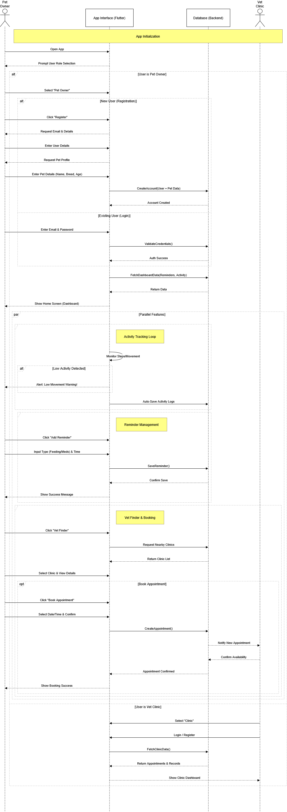
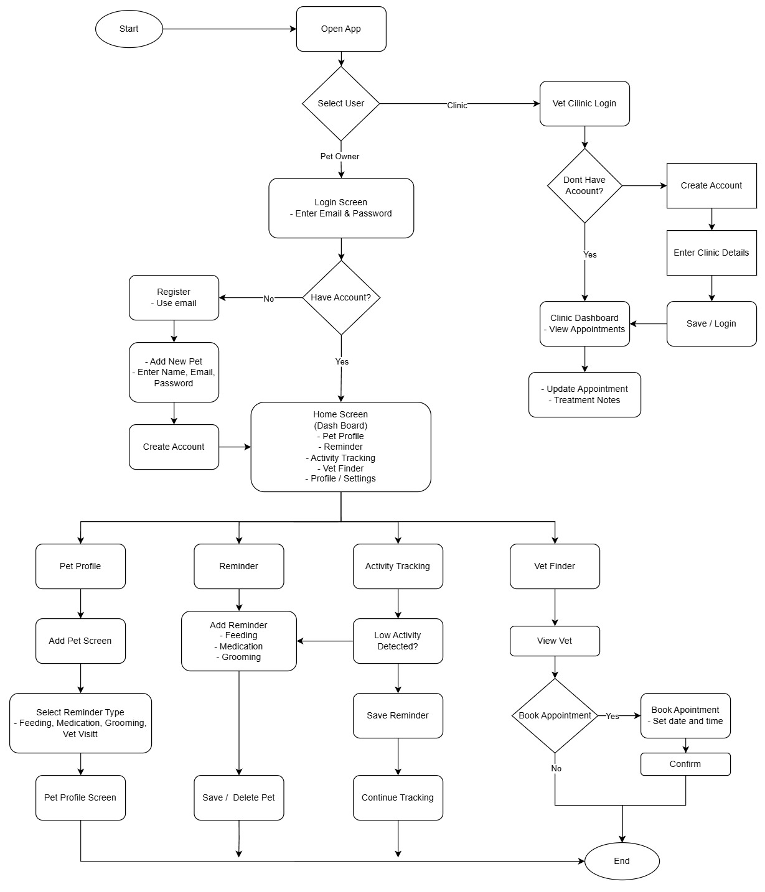

# Mobile Application Develpoment Project

## Group Members
**Group Name:** Doom Patrol
| Name | Matric No | Assigned Tasks |
| ---- | --------- | ------------- |
| Amirul Fikri Bin Amir | 2217981 | Background of the problem. Profile for users, pets, and vet clinics. |
| Tun Ainul Yaqin Bin Azmel | 2216103 | Features and functionality. Vet finder |
| Mohamad Haris Daniel Bin Abdullah | 2226517 | Target user and preferred platform. Dashboard and activity tracking. |
| Muhamad Aiman Bin Ajee Maideen | 2222077 | Purpose or objective. Reminder and notifications. |

## 1. Project Ideation & Initiation

**Title:** Pet Care

**Background of the problem:**  
    Owning a pet carries a lot of responsibility, as they require care and attention. This is especially true when owning multiple 
pets whith each having different needs and health conditions. Many owners unintentionally forget crucial responsibilities such as vaccination dates, routine vet checkups, grooming appointments, and daily medication because they rely on memory or physical notes that can be easily misplaced. Another common issue is the lack of tools to monitor a pet’s daily activity or movement, that could help pet owners to detect any problems that their pets have.

**Purpose or objective:**  
The objectives of the app are:
- Provide a centralized platform for managing pets’ medical records, vaccination dates, activities, and health conditions.
- Help owners maintain consistent daily care through reminders.
- Enable real-time monitoring of pet activity to identify early signs of health concerns.
- Support veterinary clinics by allowing them to easily share updates, records, and appointment schedules with pet owners.

**Target user:** Pet owners and veterinary clinics.

**Preferred platform:** Mobile application. Using flutter and dart language.

**Features and functionality:**  
- Profile: Different profiles for pet owners, pets, and vet clinics. Owner's name and contact details. Pets' profile contains name, breed, age, weight, and photo, along with medical history (vaccines, allergies, past checkups).

- Health dashboard (Home screen): A quick overview with upcoming reminders.

- Reminder: Remind owners about feeding time, grooming appointments, medication or vitamins, and vet checkups or vaccination dates.

- Activity tracking: Track steps, distance, calories burned. Alert if pet hasn’t moved much (possible health issue)

- Vet finder: Show nearby veterinary clinics or pet hospitals. Include contact info, map directions, and opening hours.

## 2. Requirement Analysis & Planning  

## CRUD Operations Analysis
### Pet Owner
- Create accounts, pet profiles, reminders, and medical records
- Read pet health dashboard, activity data, and reminders
- Update pet details, reminder schedules, and health records
- Delete inactive pet profiles and outdated records

### Pet Profile
- Create pet information including name, breed, age, weight, and photo
- Read health history and activity tracking data
- Update health-related information
- Delete pet profiles when no longer required

### Veterinary Clinic
- Create clinic accounts and profiles
- Read authorized pet medical records and appointment requests
- Update clinic information, appointment schedules, and treatment notes
- Delete outdated appointment or service records

---

### Firebase and Package Planning
Firebase was selected due to its real-time synchronization, built-in authentication, cloud storage support, and scalability. The planned Flutter packages include:
- Firebase Authentication
- Cloud Firestore
- Firebase Storage

## Sequence Diagram  
  

## Screen Navigation Flow

## Gantt Chart

## 3. Project Design   
Figma: https://www.figma.com/design/xJbuvQeZgDbKIHkdIaNUxL/PetCare?node-id=0-1&t=f6zIwF1pEpKE6xFn-1

## References
- Add data to Cloud Firestore. (n.d.). Firebase. Retrieved February 2, 2026, from https://firebase.google.com/docs/firestore/manage-data/add-data

- BottomNavigationBar class—Material library—Dart API. (n.d.). Retrieved February 2, 2026, from https://api.flutter.dev/flutter/material/BottomNavigationBar-class.html

- Md Yusaini, N. Y. S., & Ali, N. A. (2025). PetPals: A Pet Care Companion Mobile Application for Pet Owners. Journal of Computing Technologies and Creative Content. https://doi.org/10.70672/qnhmye46

- Navigation and routing. (n.d.). Retrieved February 2, 2026, from https://docs.flutter.dev/ui/ui/navigation/index.md

- PetCare: A Smart Pet Care Mobile App Implementation and Functionality. (2025). International Journal of Modern Research in Engineering & Science (IJMRSET), 8(3).

- Towards mHealth applications for pet animal owners: a comprehensive literature review of requirements. (2025). BMC Veterinary Research, 21, Article 190.

- Woofz. (n.d.). In Wikipedia. https://en.wikipedia.org/wiki/Woofz

- Wrap class—Widgets library—Dart API. (n.d.). Retrieved February 2, 2026, from https://api.flutter.dev/flutter/widgets/Wrap-class.html
